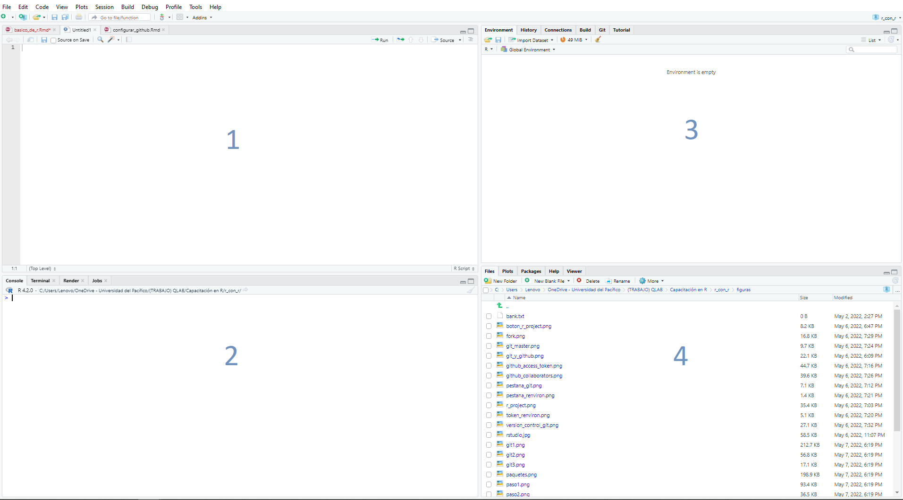

```{r setup, include=FALSE}
knitr::opts_chunk$set(echo = TRUE)
```

```{r, eval=TRUE, echo=FALSE}
knitr::include_graphics("figuras/rstudio.jpg")

```

En esta sesión explicaré algunos aspectos básicos de R a tomar en cuenta. Comencemos.

# Paneles de R

De manera previa, resulta importante familiarizarse con el entorno gráfico de RStudio lo cual se puede observar en la siguiente imagen:

```{r, eval=TRUE, echo=FALSE}


```

**Sección 1**

- Se encuentran los archivos o scripts (usualmente extensión `.R` y `.Rmd`) en los cuales podemos escribir código que queremos preservar o revisar más adelante. Si hacemos la analogía con Office Word, en el panel 1 estaría el documento en blanco a editar.

**Sección 2**

- Se encuentra la consola en la que podemos ingresar código de R directamente, pero que a diferencia del panel 1 no se guardará como parte de un documento. Asimismo, cualquier código que corramos en el panel 1 aparecerá en el panel 2 como una manera de llevar un registro durante la sesión. Ingresar código directamente en la consola es útil cuando queremos ejecutar porciones de código pequeñas o realizar operaciones matemáticas (R es como una calculadora...pro).

**Sección 3**

- Se encuentra el `Environment` donde podemos visualizar los objetos que hemos creado en R. Más adelante profundizaremos en lo que significan los objetos, por ejemplo, si corres este código en la consola `a<-2+2` te aparecerá en tu `Environment` un vector numérico de valor 4, este vector se ha denominado `a`.

**Sección 4**

- Se encuentran los archivos del usuario como si fuera la carpeta de "Mis Documentos" en Windows. De esta manera podemos acceder fácilmente a archivos de nuestra computadora y de nuestro directorio de trabajo.

# Objetos

R en gran medida es un lenguaje orientado a objetos por lo que el resultado del código que ejecutamos puede ser encapsulado en un objeto para ser usado más adelante. Retomando el ejemplo anterior podemos ejecutar el siguiente código:

```{r}
a<-2+2
a
```
En el ejemplo anterior, he creado un objeto `a` y luego he llamado ese objeto mencionando para que muestre lo que lleva adentro (4). Ahora crearé el objeto `b`:

```{r}
b<-5+1
b
```
El objeto `a` y `b` son vectores numéricos por lo que puedo realizar operaciones entre ellos. En primera instancia puedo sumarlos entre ellos y/o con otros números:

```{r}
a+b+6
```

## Tipos de objetos

A continuación veremos los tipos de objetos principales en R. Para poder verificar el tipo de objeto nos apoyaremos de la función `class()`


### Vector numérico

Como vimos anteriormente, un vector numérico se compone de uno o más números lo que nos permite realizar operaciones aritméticas. Por ejemplo:

```{r}

#un número=3
c<-1+2

#dos números=c(1,2)
d<-c(1,2)

#c es un vector numérico
class(c)
```

Cuando tenemos un vector con más de un número, las operaciones aritméticas que realizamos se aplican a cada uno de sus elementos:

```{r}
#Cada elemento de d x 2
d*2
```

### Vector de caracteres

Un vector de caracteres almacena texto dentro de sus elementos. No permite que se realice operaciones aritméticas; no obstante, podríamos calcular la frecuencia con que se repite cada elemento. Por ejemplo:

```{r}
palabras<-c("arroz", "jamón", "queso", 4, 
            "arroz", "jamón", "queso", 4, 
            "arroz", "jamón", "queso", 4, 
            "arroz", "jamón", "queso", 4)
  
class(palabras)  
```

El objeto `palabras` es un vector "character" que engloba texto únicamente, por lo que podemos contabilizar cuántos elementos repetidos tiene:

```{r}
table(palabras)
```

Nótese que aunque he incluido un número a propósito (el 4) dentro de un vector con texto, igual reconoce este número como un texto. En este caso, se podría hacer la equivalencia: `4="4"="cuatro"`. Es por ello que cuando realizamos una tabla de frecuencias contabiliza cuántos 4 hay en vez de sumar los cuatro 4s.

### Vector lógico

Un objeto lógico es un vector booleano dicotómico cuyos valores pueden ser únicamente `TRUE` o `FALSE`. Por ejemplo:

```{r}
resultados<- c(TRUE, TRUE, FALSE, FALSE)

class(resultados)
```

Los vectores lógicos son útiles cuando se trabaja con condiciones lógicas del tipo `if else`. Por ejemplo:

```{r}

#una abreviación para TRUE es T y para FALSE es F
aprueba_examen=T

#if(vector lógico){en caso TRUE}else{en caso FALSE}
if(aprueba_examen){"Felicitaciones por aprobar el examen"}else{"Más suerte la próxima"}

```

### Dataframe

En la práctica de R, es más probable que trabajemos con *dataframes* antes que vectores. Un dataframe es un conjunto de vectores o variables que constituyen una matriz. Por ejemplo:

```{r}
base<- data.frame(
  persona=c("María Pía", "Santiago", "Pavel", "Mauricio"),
  nota=c(15, 17, 20, 16),
  aprueba=c(F,T,T,T)
)

base
```

En este dataframe de valores aleatorios podemos ver que tenemos los tres tipos de vectores = character, numérico, y lógico. Cabe mencionar que deben haber el mismo número de valores dentro de cada vector, es por ello que, cada vector cuenta con 4 valores.

Asimismo, un dataframe nos permite generar variables a partir de los valores de otras variables presentes en el dataframe. Por ejemplo:

```{r}
base$mensaje<-ifelse(base$aprueba,"Felicitaciones por pasar el examen","Más suerte la próxima")

base
```

# Estilos de programación en R

## Estilo tradicional

muñeca rusa (foto)

## Estilo moderno

Esto es una pipa (foto)

pipeflow

pipeta

maggritr


# Preparación de data

tidy data

tidy names

# Manejar directorios de trabajo

Directorio absoluto

setwd / getwd absoluto

