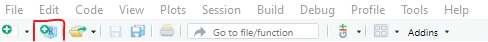
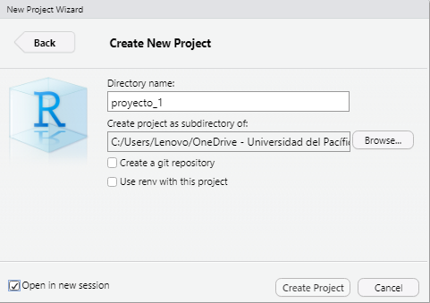
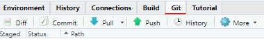
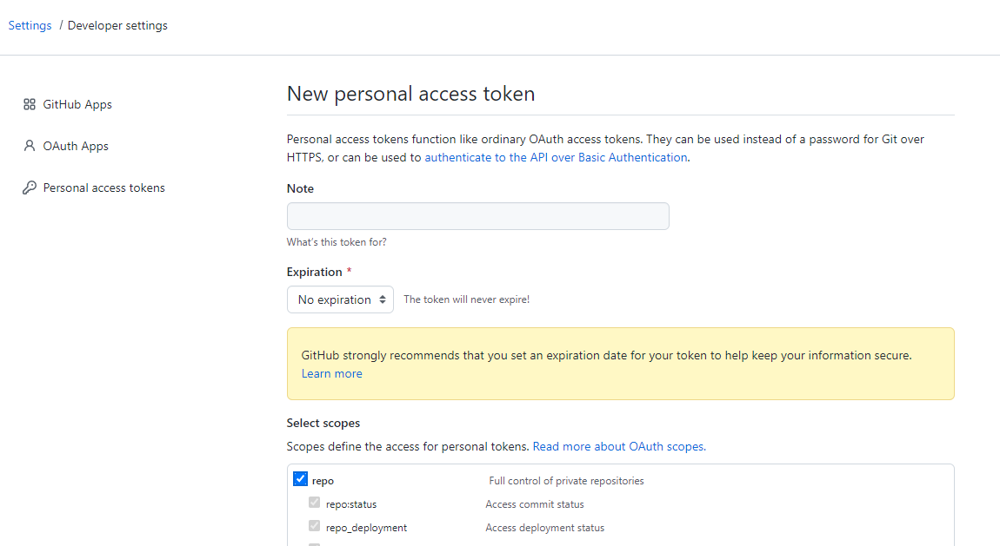
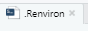
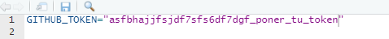
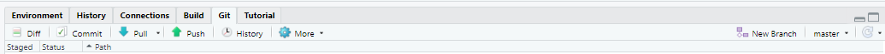
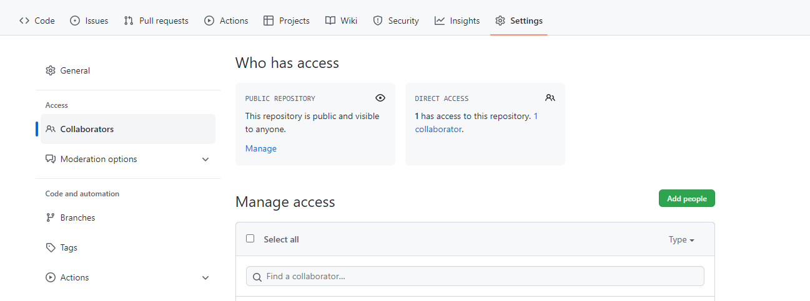
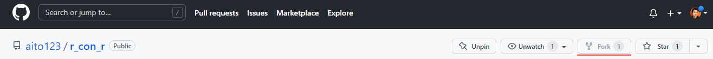
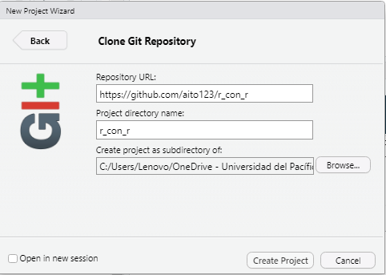

```{r setup, include=FALSE}
knitr::opts_chunk$set(echo = TRUE,eval = FALSE)
```

```{r, eval=TRUE, echo=FALSE}
knitr::include_graphics("figuras/git_y_github.png")
```


En esta sesión explicaré como configurar Git y Github con RStudio para poder trabajar de manera colaborativa y con un control de versiones.

Para esto es necesario tener instalado Git en nuestra computadora. Puedes acceder a Git en el siguiente [link](https://git-scm.com/downloads).

# Configuración de Git y Github

Para empezar nos dirigiremos al explorador de archivos o Mis documentos en tu computadora y creamos una carpeta llamada "proyecto1".

Bien. Ahora nos dirigimos a R y en la parte superior del RStudio y debajo de la palabra Edit verás una R +. 

```{r, eval=TRUE, echo=FALSE, out.width='80%', fig.align='center'}

```

Le hacemos click a `New Directory < New Project`, ingresamos un nombre como "proyecto1", nos aeguramos que se está guardando en nuestra nueva carpeta "proyecto1" (browse), dejamos sin seleccionar las casillas debajo excepto la de "Open in New Session". 

```{r, eval=TRUE, echo=FALSE, out.width='60%', fig.align='center'}

```

Luego de esto creamos el proyecto y wuala.

## Crearse un Github

Segundo, necesitamos una cuenta en [Github](https://github.com/), en esta página distintos desarrolladores comparten su código y elaboran soluciones utilizando código. Una vez creada la cuenta de Github la tendremos abierta en nuestro navegador (de preferencia Chrome) para poder sincronizarla con nuestro RStudio.

## Presentarse a Git

Ahora, nos dirigimos a nuestro Rstudio y nos aseguramos de tener los paquetes necesarios para trabajar. Para correr un código seleccionamos el código que queremos correr y apretamos `control` + `enter`:

```{r}
if (!require("pacman")) install.packages("pacman")
pacman::p_load(devtools, usethis, tidyverse)

```

Git es un programa que recopila un historial de versiones de un mismo documento/archivo. De esta manera, podemos regresar a una versión pasada de ser necesario. Git también registra quién ha realizado cada cambio por lo que debemos presentarnos a Git. Lo haremos de esta manera:

```{r}
use_git_config(user.name = "Mi Nombre", user.email = "mi_correo@gmail.com")

```

Tener en cuenta que el correo ingresado debe ser el mismo que el utilizado para crear tu cuenta de Github.

Nuestro objetivo es que aparezca la pestaña "Git" en la esquina superior derecha entre la pestaña "Connections" y "Tutorial" por lo que corremos el siguiente comando.

```{r}
usethis::use_git()
```

Nos aparecerá un mensaje abajo en la consola indicando si queremos *commit* los cambios realizado. Es importante que ingresemos la opción **NO**. Las opciones están constantemente cambiando así que marque la opción que se refiere al no. Seguido a esto, nos aparecerá otra indicación diciendo si queremos reiniciar el R para crear la pestaña "Git". Recién en este caso marcamos la opción **SÍ** o un enunciado similar. Se reiniciará el R y si ha seguido estos pasos aparecerá la pestaña Git en la esquina superior derecha.

```{r, eval=TRUE, echo=FALSE, out.width='80%', fig.align='center'}

```

## Conectarse a Github

Para conectarnos a Github necesitamos generar un Token que nos dé las facultades para poder manipular nuestro Github desde el RStudio para esto corremos la siguiente función:

```{r}
usethis::create_github_token(
  description = "mi_token"
  )

```

Una vez corramos este comando se debería abrir una página en internet con nuestro Github abierto en la sección Tokens (Developer Settings). En la pestaña habrán varias casillas para marcar, de preferencia marcamos todas. Asimismo, en la caducidad del Token insertamos _No expiration_ y luego creamos el token en la parte de abajo.

```{r, eval=TRUE, echo=FALSE, fig.align='center'}

```

A continuación, nos aparecerá un código largo el cual vamos a copiar. Seguido a esto, nos dirigimos al RStudio y corremos la siguiente función:

```{r}
usethis::edit_r_environ()

```

```{r, eval=TRUE, echo=FALSE, out.width='30%', fig.align='center'}

```

Aparecerá un archivo en la pantalla llamado `.Renviron` y dentro de este vamos a ingresar el siguiente código en una línea vacía:

`GITHUB_TOKEN="número largo de mi token"`

```{r, eval=TRUE, echo=FALSE, out.width='80%', fig.align='center'}

```

Luego cerramos el archivo `.Renviron` y reiniciamos nuestro R yendo a Session < Restart R.

Una vez reiniciado nuestro R nos dirigimos a la pestaña Git y seleccionamos los cambios realizados. Si te percatas en la esquina superior derecha de la pestaña Git debería salir `no branch`. Ahora apretamos el botón _commit_ en la parte superior. Se abrirá un panel con un espacio para insertar texto a la derecha. Ahí pondremos "Primer commit", luego clickeamos el botón commit en la parte de abajo. Saldrá una pestaña de carga y luego nos permitirá cerrar. Cerramos las pestañas y regresamos a nuestro script de R. Ahora en la esquina superior derecha de la pestaña Git debería salir `master` o `main`. Si aparece esto en tu panel superior derecho vas por buen camino y ya casi acabas:

```{r, eval=TRUE, echo=FALSE, fig.align='center'}

```

A continuación corremos el siguiente comando:

```{r}
usethis::use_github()

```

Debería aparecer un cuadro de diálogo de Github en el que nos pida nuestro usuario, contraseña o código. Utilizamos la opción código y nos debería llevar a la pestaña de Chrome. Para corroborar que la conexión se ha establecido, regresamos a nuestro R y verificamos si la flecha verde en la pestaña Git se encuentra encendida. En caso lo esté, vas y le apretas click. Has realizado tu primer "Push". 

Ahora hay una copia de tu proyecto actual ("proyecto1") en Github el cual puedes actualizar con Git y R.

Cabe recalcar que este proceso se realiza una sola vez y no es necesario de repetir continuamente cada vez que se quiere iniciar un proyecto.

# Tipos de interacción con Github

## Solo play

Lo que hemos hecho hasta ahora podríamos considerarlo como colaborar con uno mismo o usar el Github de manera individual. El *workflow* es el siguiente:

- Crear un R Project en una nueva sesión

- Utilizar el comando `usethis::use_git()`, confirmar el commit (Sí)

- Push commit a Github

## Multiplayer Collaborative

Este tipo de interacción se caracteriza por colaborar con una o más personas como si todos fueran dueños del proyecto y puedan hacer cambios directos. Para esto, la persona que quiere iniciar el repositorio en Github debe seguir los pasos del "solo play" y subir su proyecto a Github. Una vez realizado esto, nos dirigimos a la web Github y en nuestro proyecto accedemos a la parte de _Settings_. Luego, en el apartado _Access_ clickeamos a _Collaborators_ y acá añadimos las cuentas con las que queremos colaborar directamente.

```{r, eval=TRUE, echo=FALSE, fig.align='center'}

```

Las personas que se quieren sumar a tu repositorio deben hacer lo siguiente. Se dirigen a su RStudio y luego apretan el botón R + debajo de Edit en la parte superior. 

```{r, eval=TRUE, echo=FALSE, out.width='80%', fig.align='center'}

```

En segundo lugar, siguen la ruta `Version Control < Git` y en la parte de repositorio URL ingresan el link web al repositorio Github ya creado. En tercer lugar, crean el proyecto en una sesión nueva.

Listo, ahora tienes acceso directo a un repositorio ya creado por un colega al cual puedes commitear y pushear.

Cabe mencionar que la versión en tu computadora debe estar al día con la versión en el Repositorio Github por lo que antes de commitear y pushear algún cambio es necesario clickear la flecha celeste de _Pull_ que actualiza la versión local a la de internet.

## Multiplayer Pull request

Como habrás podido observar, en la interacción "Multiplayer Collaborative", los colaboradores pueden hacer cambios directamente sin necesidad de que nadie revise y aprueba sus cambios. Esto puede ser beneficioso cuando se tiene grupos de trabajo pequeños; sin embargo, a medida que se tiene a más colaboradores resulta conveniente una manera de poder aprobar los cambios antes de implementarlos a la versión Github Repositorio Web. Para esto tenemos la interacción "Multiplayer Pull request".

Como hemos realizado anteriormente, el dueño del repositorio debe seguir los pasos de "Solo Play" para subir su repositorio a la nube. Sin embargo, en esta interacción no necesita poner a ninguna persona como colaborador directo.

En caso haya un usuario que quiera sugerir un cambio al Repositorio de Github creado por el dueño debe realizar lo siguiente.

- Dirigirse a Github en el navegador Chrome.

- Una vez ubicado el Repositorio del dueño en Github, hacer click en el botón _Fork_ (fork creará un duplicado en tu Github del proyecto)

```{r, eval=TRUE, echo=FALSE, out.width='80%', fig.align='center'}

```

- Luego de fork-earlo, dirigirse a RStudio y crear un nuevo proyecto con ruta `Version Control < Git`, y en el url insertar el url del duplicado en tu Github.

```{r, eval=TRUE, echo=FALSE, out.width='60%', fig.align='center'}

```

Listo, ahora tienes una copia del proyecto en tu RStudio. Supongamos que quieres realizar un cambio a un archivo. Luego de realizar dicho cambio commit y push. Ahora, nos dirigimos a Github en Chrome y en el repositorio duplicado en nuestra cuenta verá la opción para poder crear un _Pull Request_. Una vez mandado el pull request, el dueño del repositorio original decidirá aceptar o rechazar tu cambio.


