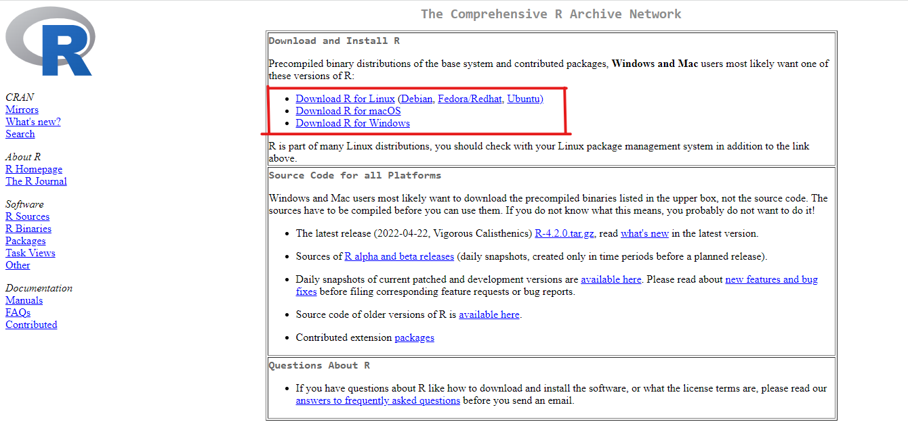
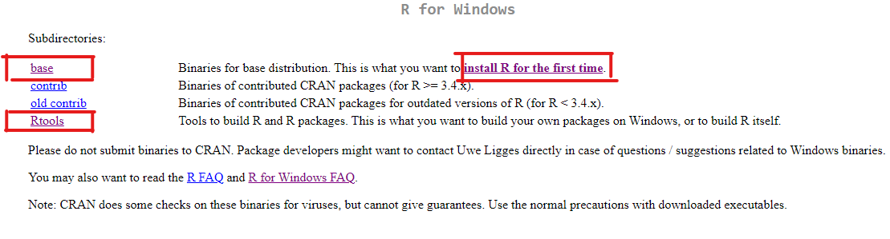
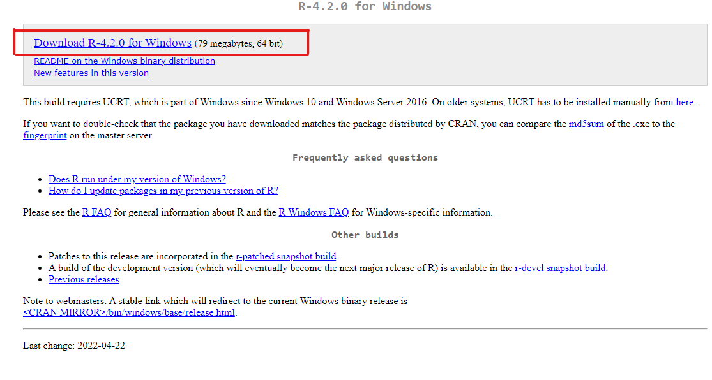
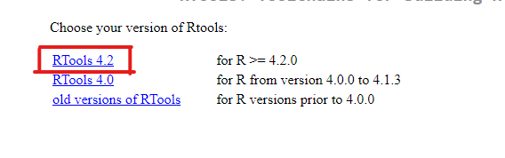
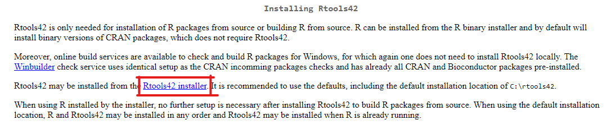
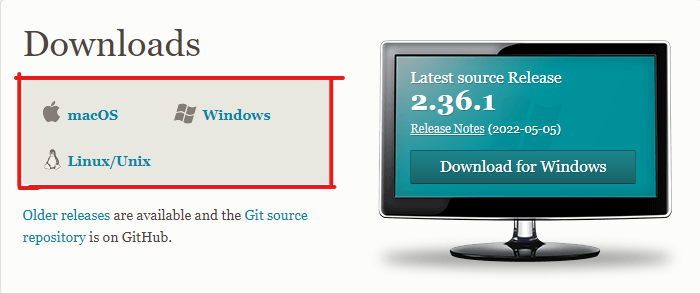
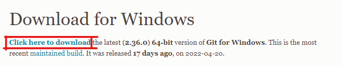

  
```{r setup, include=FALSE}
knitr::opts_chunk$set(echo = TRUE)
```

```{r, eval=TRUE, echo=FALSE, out.width='100%', fig.align='center'}
knitr::include_graphics("figuras/r.jpg")
```


En esta sesión explicaré como actualizar y/o instalar R-Studio (La plataforma), R(El programa) y R-Tools (las herramientas). Asimismo se detallará como instalar Git en tu computadora.


# Instalación y/o actualización de R,R-studio y R-tools

**Paso 0** : Si ya tienes instalado R y deseas actualizarlo a la última versión, tienes que desinstalarlo e instalar la nueva verisón.

**Paso 1** : Entramos al siguiente [Link](https://cran.r-project.org)

**Paso 2** : Seleccionamos segun el Software de la computadora

```{r, eval=TRUE, echo=FALSE, out.width='100%', fig.align='center'}

```

**Paso 3** : Haces click en "Install R fot the first time" si es la primera vez que bajas R, en "base" si ya haz descargado antes R y quieres la nueva versión. Una vez descargados regresaremos a esta pagina y haremos click en "R-tools"(Más adelante se especificaran los pasos.)

```{r, eval=TRUE, echo=FALSE, out.width='100%', fig.align='center'}

```
**Paso 4** : Hacemos click en donde esta señalado .

```{r, eval=TRUE, echo=FALSE, out.width='100%', fig.align='center'}


```
**Paso 5** : Abres el programa instalado y pones aceptar en todo lo que salga seleccionado como predeterminado

**Paso 6** : Regresamos a la pagina del paso 3 y hacemos click en "R-tools"

```{r, eval=TRUE, echo=FALSE, out.width='100%', fig.align='center'}

```

**Paso 7** : Haces click en la última versión de Rtools disponible, la señalada.

```{r, eval=TRUE, echo=FALSE, out.width='100%', fig.align='center'}


```
**Paso 8** : Haces click en donde esta señalado.

```{r, eval=TRUE, echo=FALSE, out.width='100%', fig.align='center'}

```

**Paso 9** : Abre el programa y aceptas en todo lo señalado de forma predetermianda y listo!

# Instalación de Git

**Paso 1** : Abres el siguiente [Link](https://git-scm.com/downloads) y seleccionas la opción según el Software de tu computadora

```{r, eval=TRUE, echo=FALSE, out.width='100%', fig.align='center'}


```
**Paso 2** :  Haces click en donde esta señalado.


```{r, eval=TRUE, echo=FALSE, out.width='100%', fig.align='center'}

```
**Paso 3** : Abre el programa y pones aceptar en todo lo que aparezca seleccionado de forma predeterminada.
