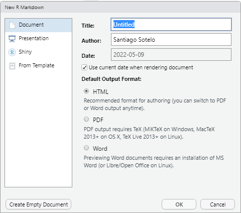
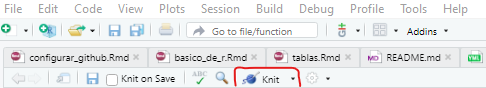
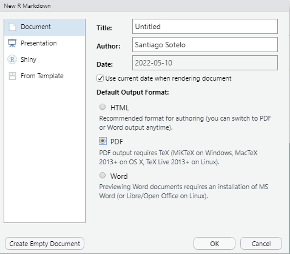

```{r setup, include=FALSE}
knitr::opts_chunk$set(echo = TRUE, fig.align = "center")
```

```{r, eval=TRUE, echo=FALSE, out.width="100%"}
knitr::include_graphics("figuras/reportes.png")

```

En esta sesión explicaré como exportar reportes en R en formato `.html`, `.docx`, y `.pdf`.

Para ello necesitaremos tener instalados y desplegados los siguientes paquetes:

```{r}
pacman::p_load(
  #manipulación de data
  tidyverse,
  #importar exportar data
  haven, rio,
  #tablas
  flextable, gtsummary,
  #etiquetas
  sjlabelled,
  #exportar reportes
  officer, officedown
)

```

# Lo básico: RMarkdown y Knitr

Realizar reportes en R nos puede ser de utilidad para cuando queremos, por ejemplo, presentar múltiples gráficos y tablas. Resultaría un poco tedioso exportar cada gráfico realizado en R en formato `.png` y luego insertarlo en un documento de Word para luego presentarlo. 

Asimismo, realizar reportes en R permite una mayor reproducibilidad del proceso realizado, lo cual puede ser revisado por otros colegas. 

Dicho esto, empezemos por comprender el proceso de construcción de un reporte. Todo reporte se deriva de un archivo RMarkdown. Como su nombre lo dice, estos documentos se caracterizan por combinar lenguaje `R` con `md` (markdown). [Markdown](https://markdown.es/) es un lenguaje de marcado ligero que nos permite realizar cuestiones de formato como **negritas**, *cursiva*, ***cursivaynegrita***, con una mayor reproducibilidad y legibilidad. *Knit* es el paquete que nos permite convertir un archivo `.Rmd` a diferentes outputs de la siguiente manera:

```{r, eval=TRUE, echo=FALSE}
knitr::include_graphics("figuras/knit_workflow.png")

```

Un aspecto característico de los RMarkdown, es el encabezado que tiene (*YAML header*). Es en este espacio en que se define el tipo de output que tendrá el archivo `.Rmd`. Por default suele ser un output HTML por lo que comenzaremos con este.

# Reportes en HTML

Cuando creamos un documento `.Rmd` desde `File < New File < R Markdown` nos aparece la siguiente pestaña:

```{r, eval=TRUE, echo=FALSE, out.width='80%'}


```

Y si le damos "OK" nos creará un *YAML header* con los aspectos básicos necesarios para generar un HTML output:

```{r, eval=FALSE}

---
title: "Untitled"
author: "Santiago Sotelo"
date: "`r Sys.Date()`"
output: html_document
---

```

En este ejemplo, el output está programado para ser un HTML, es decir, que se verá como una página continúa sin cortes (no paginado). Ahora bien, es importante tomar en cuenta cuál será nuestro output al momento de elaborar nuestros gráficos y tablas. Por ejemplo, si mi objetivo es generar un reporte en HTML entonces me apoyaré en paquetes como `{gtsummary}` o `{DT}`para generar tablas HTML. Es así como este documento "Exportar reportes en R" se encuentra exportado en HTML por lo que renderiza adecuadamente tablas como esta:

```{r}
trial %>% 
  tbl_summary(include=grade)
```

Sin embargo, este tipo de tablas no es adecuado para reportes en Word o pdf. Por último, si queremos exportar nuestro `.Rmd` a `.html` clickeamos el botón "Knit" que se encuentra en la parte superior de RStudio y esperamos a que aparezca nuestro documento HTML.

```{r, eval=TRUE, echo=FALSE, out.width='80%'}

```

# Reportes en PDF

Si regresamos al panel para generar reportes en `.Rmd` (`File < New File < R Markdown`) veremos que también nos brinda la posibilidad de elegir un output en PDF:

```{r, eval=TRUE, echo=FALSE, out.width='80%'}


```

Un aspecto positivo del output PDF es, más allá de ser paginado, es decir se puede dividir en páginas numeradas óptimo para un trabajo impreso, es que nos permite sacar provecho de los comandos `LaTeX` que es un sistema de composición de textos muy familiar para las personas que trabajan en [Overleaf](https://es.overleaf.com/).

`LaTeX` es un universo en sí mismo por lo que cualquier interesado puede indagar mayor información en la siguiente [página](https://es.overleaf.com/learn/latex/Commands). En esta ocasión, utilizaremos los siguientes comandos de `LaTeX`:

- `\newpage` : insertar un salto de página

- `\@ref(fig:_)` : referenciar una figura como un gráfico

- `\@ref(tab:_)` : referenciar una tabla

Si le damos "OK" a la creación del RMarkdown nos creará un *YAML header* con los aspectos básicos necesarios para generar un HTML output:

```{r, eval=FALSE}

---
title: "Untitled"
author: "Santiago Sotelo"
date: "`r Sys.Date()`"
output: pdf_document
---

```

Los comandos de `LaTeX` nos permiten aprovechar la utilidad de los documentos paginados y la referenciación. Por ejemplo, `\newpage` nos permite insertar un salto de página entre dos textos y se utiliza de la siguiente manera: 

Lorem ipsum dolor sit amet, consectetur adipiscing elit. Cras molestie tortor ut tellus dapibus, id viverra purus blandit. Nulla consequat magna at fermentum congue. Sed lobortis turpis nec est tristique, id auctor justo finibus. Mauris tristique facilisis sem, scelerisque dapibus metus tincidunt sit amet.

`\newpage`

Lorem ipsum dolor sit amet, consectetur adipiscing elit. Cras molestie tortor ut tellus dapibus, id viverra purus blandit. Nulla consequat magna at fermentum congue. Sed lobortis turpis nec est tristique, id auctor justo finibus. Mauris tristique facilisis sem, scelerisque dapibus metus tincidunt sit amet.

# Reportes en Word

Si bien R cuenta con su propio formato output `.docx`, que se denomina `word_document`, el paquete `{officedown}` nos permite tener mayor versatilidad en la edición del documento de Word desde R:

**Setup básico:**

```{r, eval=FALSE}

---
title: "Untitled"
author: "Santiago Sotelo"
date: "`r Sys.Date()`"
output: 
  officedown::rdocx_document
---
  
```

El setup mínimo de un output Word con `{officedown}` precisa el tipo de documento `rdocx_document`. En cambio, si se quiere tener mayor control sobre un documento plantilla, el estilo de las tablas, de los gráficos, el tamaño de la hoja y los márgenes se puede utilizar este setup avanzado:

**Setup avanzado de Word:**

```{r, eval=FALSE}

---
title: "Untitled"
author: "Santiago Sotelo"
date: "`r Sys.Date()`"
output: 
  officedown::rdocx_document:
    reference_docx: "Documento/documento_plantilla.docx"
    tables:
      style: Table
      layout: autofit
      width: 1.0
      align: center
      topcaption: true
      caption: 
        style: Table Caption
        pre: "Tabla "
        sep: ": "
        tnd: 0
        tns: '-'
        fp_text: !expr officer::fp_text_lite(bold = TRUE)
    plots:
      style: Normal
      align: center
      topcaption: true
      caption: 
        style: Image Caption
        pre: "Gráfico "
        sep: ": "
        tnd: 0
        tns: '-'
        fp_text: !expr officer::fp_text_lite(bold = TRUE)
    page_size:
      width: 8.3
      height: 11.7
      orient: "portrait"
---

```

Ahora bien, si queremos utilizar la referenciación en nuestro documento podemos realizar los siguientes comandos de `LaTeX`: `\@ref(fig:_)` y `\@ref(tab:_)`. Estos comandos nos permiten referenciar con un número los gráficos y tablas que desplegamos.

Por ejemplo, si utilizamos la base `economics` del paquete `{ggplot2}`:

## Figuras

```{r fig.cap="economics plot", fig.id = "tsplot", fig.cap.style = "Image Caption"}
ggplot(economics, aes(date, unemploy / pop)) + 
  geom_line() + 
  theme_minimal()
```

Esta es una referencia a la gráfico **1** <- `\@ref(fig:tsplot)`.

## Tablas

```{r tab.cap="economics table", tab.id = "mytab", tab.cap.style = "Table Caption"}
head(economics) %>% 
  gt::gt()

```

Esta es una referencia a la tabla **1** <- `\@ref(tab:mytab)`.

**Más recursos para aprender:**

- [Knitr](https://yihui.org/knitr/)

- [officedown](https://ardata-fr.github.io/officeverse/officedown-for-word.html)

- [officer](https://davidgohel.github.io/officer/)

